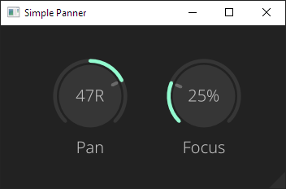

# Simple Panner

Simple Panner is a stereo panning plugin that I built as a way to learn plugin development using the amazing [NIH-plug](https://github.com/robbert-vdh/nih-plug) framework and the [VIZIA](https://github.com/vizia/vizia) UI library.



## How to use

Simple Panner has two parameters, `Pan` and `Channel Mix`.

`Pan` controls the gain of the left and right channels.

`Channel Mix` controls the mixing of the two channels _before_ panning the sound.

-   When set to `0%`, audio is not mixed between channels and panning will purely control the gain of each channel. This will keep the sound wide, but still allow you to control the stereo balance of the track.

-   At `100%`, both channels are mixed into each other evenly. This is equalivalent to converting the audio to mono and then panning it, offering a more localized sound.

## Building

After installing [Rust](https://rustup.rs/), you can compile Simple Panner as follows:

```shell
cargo xtask bundle simple_panner --release
```

## License

Copyright (C) 2023  Daniel Fernandes

This program is free software: you can redistribute it and/or modify
it under the terms of the GNU General Public License as published by
the Free Software Foundation, either version 3 of the License, or
(at your option) any later version.

This program is distributed in the hope that it will be useful,
but WITHOUT ANY WARRANTY; without even the implied warranty of
MERCHANTABILITY or FITNESS FOR A PARTICULAR PURPOSE.  See the
GNU General Public License for more details.

You should have received a copy of the GNU General Public License
along with this program.  If not, see <https://www.gnu.org/licenses/>.
